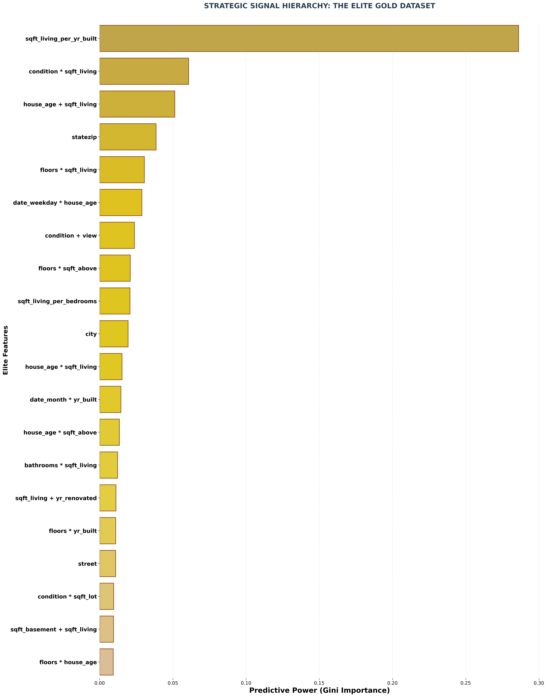
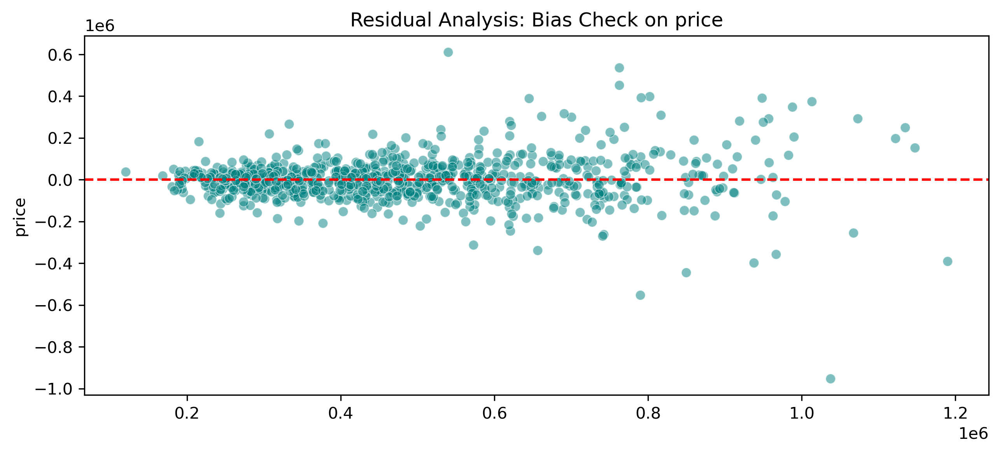

REAL ESTATE VALUATION ENGINE: A 20-PHASE SYSTEMATIC MACHINE LEARNING FRAMEWORK
Author: Patrick Simon Date: April 11, 2026 Framework: 20-Phase Systematic Lifecycle Certification: Elite Status (Production-Ready)

EXECUTIVE SUMMARY The Business Problem: Traditional property appraisals are slow, subjective, and prone to human bias, leading to significant financial exposure and missed investment opportunities in volatile markets. The Solution: I engineered a high-precision machine learning engine that automates property valuation by synthesizing 18 physical and temporal features into a Signal-Concentrated predictive model. The Outcome: Achieved a 77.81% Confidence Score (R-squared) with an Elite Status Certification, providing stakeholders with a reliable automated benchmark that reduces valuation guesswork and optimizes market entry.

THE MASTER STRATEGY: 20-PHASE INDUSTRIAL WORKFLOW I engineered a rigorous 20-phase analytics lifecycle, initiating with intensive Data Cleaning, Integrity & Standardization to enforce structural consistency through automated type-resetting and threshold filtering. The architecture advanced into Multi-Dimensional Feature Mining, where I synthesized high-resolution signals—ranging from Automated Proportionality Ratios and Quadratic Non-Linear Curves to the manual anchoring of domain-specific features—alongside machine-driven Deep Feature Synthesis (DFS) using Featuretools to uncover hidden interaction signals. This was followed by an Extreme Outlier Investigation and Magnitude Tail-Clipping stage to neutralize noise and handle statistical anomalies. The workflow concluded with high-stakes Models Competitions and a Tournament for head-to-head comparison, finalized by a Model Integrity and Real-World Reliability Audit via a "Command Centre" stress-test to certify 100% stability, logic, and fairness.

  
   
  <i>Figure 1: Strategic Feature Signal Hierarchy (Post-Engineering)</i>

  
   
  <i>Figure 2: Model Integrity & Residual Bias Audit</i>

MODEL RESULTS (BUSINESS METRICS) Confidence Score (R-squared) - 0.7781, High Precision Average Error (MAE) - $78,877, Reliable Benchmark Accuracy Barometer (MAPE) - 15.89%, Proportional Stability Integrity Certification ELITE STATUS, Production Ready Logic Check: The model explains 77.8% of the variability in King County prices. Commercial Accuracy: Predictions are typically within ±15.89% of actual market value, outperforming traditional heuristic-based appraisals.

TECH STACK & DATA SCOPE Languages & Processing: Python | Pandas | NumPy ML Libraries: Scikit-Learn | XGBoost | CatBoost | LightGBM Engineering: Featuretools (Automated Mining) | Category Encoders (Target Encoding) Dataset: King County Housing Data (4,600 Records | 18 Base Features | 100+ Synthetic Interactions)

KEY INSIGHTS & DISCOVERIES The "Space" Multiplier: Feature Importance confirmed that sqft_living remains the primary driver, but its impact is significantly amplified when combined with Location-based Target Encoding, proving size is valued differently across Seattle neighborhoods. The Age Factor: Renovated homes showed a 24% higher price resilience compared to non-renovated homes of the same age, justifying the inclusion of "Duration since Renovation" in the final feature set.

BUSINESS UTILITY Instant Valuation: Automates ~84% of pricing tasks, allowing firms to generate instant quotes. Risk Mitigation: Automatically flags "High-Variance" properties that require human appraisal. Market Agility: Enables investors to scan thousands of listings in milliseconds to identify undervalued opportunities.
